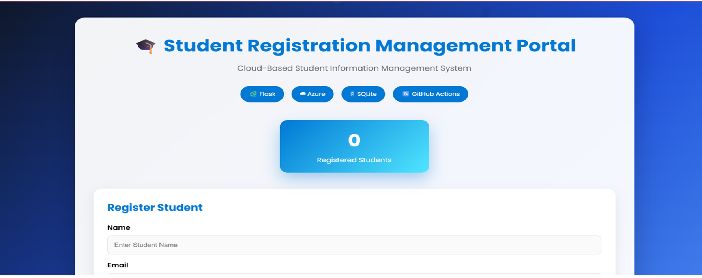
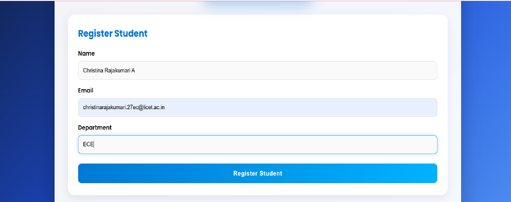
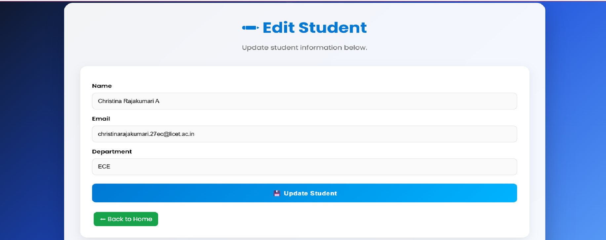
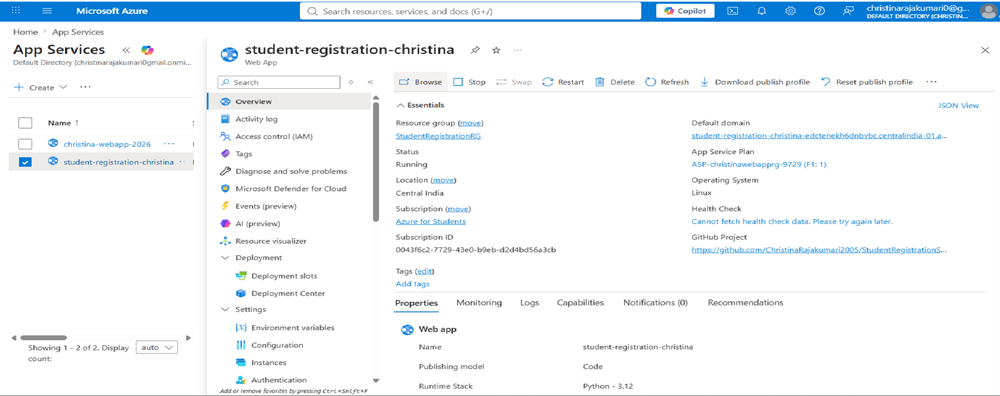

# 🎓 Student Registration Management Portal

A modern cloud-based **Student Registration Management System** developed using **Python Flask**, **SQLite**, and **Microsoft Azure App Service**. The application allows users to register, view, edit, and delete student records through a responsive web interface.

---

## 📌 Project Overview

This project demonstrates the development and deployment of a CRUD (Create, Read, Update, Delete) web application using Flask and SQLite. The application is deployed on Microsoft Azure using GitHub integration.

---

## ✨ Features

- ✅ Register new students
- ✅ View all registered students
- ✅ Edit student information
- ✅ Delete student records
- ✅ SQLite database integration
- ✅ Responsive user interface
- ✅ Cloud deployment using Microsoft Azure App Service
- ✅ GitHub version control

---

## 🛠 Technology Stack

| Technology | Purpose |
|------------|---------|
| Python | Backend Programming |
| Flask | Web Framework |
| SQLite | Database |
| HTML5 | Structure |
| CSS3 | Styling |
| Microsoft Azure App Service | Cloud Hosting |
| Git & GitHub | Version Control |

---

## 📂 Project Structure

```
StudentRegistrationSystem/
│
├── static/
│   ├── css/
│   │   └── style.css
│   └── images/
│       └── student.svg
│
├── templates/
│   ├── index.html
│   └── edit.html
│
├── app.py
├── students.db
├── requirements.txt
├── startup.txt
└── README.md
```

---

## 📷 Screenshots

### 🏠 Home Page




---

### ➕ Register Student

---

### ✏ Edit Student



---

### ☁ Azure Deployment



---

## 🚀 Installation

Clone the repository

```bash
git clone <your-github-repository-url>
```

Move into the project

```bash
cd StudentRegistrationSystem
```

Create a virtual environment

```bash
python -m venv venv
```

Activate it

Windows

```bash
venv\Scripts\activate
```

Install dependencies

```bash
pip install -r requirements.txt
```

Run the application

```bash
python app.py
```

Open

```
http://127.0.0.1:5000
```

---

## ☁ Azure Deployment

This application is deployed using:

- Microsoft Azure App Service
- GitHub Deployment
- Flask
- SQLite Database

---

## 🔮 Future Enhancements

- User Authentication
- Search Student
- Department Filter
- Export Student Records
- Dashboard Analytics
- Email Notifications

---

## 👩‍💻 Developed By

**Christina Rajakumari**

Electronics and Communication Engineering (ECE)

Loyola-ICAM College of Engineering and Technology

---

## ⭐ If you like this project

Please consider giving this repository a ⭐ on GitHub.